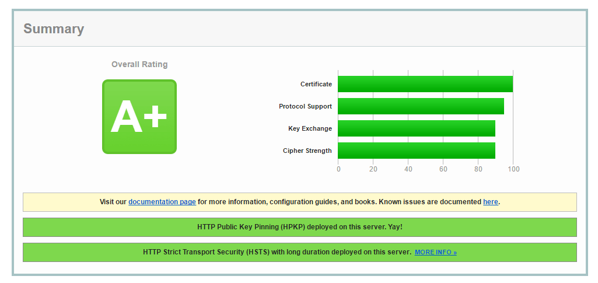

# foxboxsnet/nginx-proxy-alpine-letsencrypt

  [](https://hub.docker.com/r/foxboxsnet/nginx-proxy-alpine-letsencrypt 'DockerHub') [](https://hub.docker.com/r/foxboxsnet/nginx-proxy-alpine-letsencrypt 'DockerHub')

| Branch  | Build Status |
|:--------|:-------------|
| Release | [](https://circleci.com/gh/FoxBoxsnet/nginx-proxy-alpine-letsencrypt/tree/Release) |
| Develop | [](https://circleci.com/gh/FoxBoxsnet/nginx-proxy-alpine-letsencrypt/tree/dev) |

## Description
high security of the nginx-proxy.

## Usage
---
### Environment
+ `NGX_STS_IP` nginx status for `server_name` IP address  
Example : `-e NGX_STS_IP='192.168.25.254'`
  
+ `NGX_STS_NW` nginx status `allow` permission network   
Example : `-e NGX_STS_NW='192.168.25.0/24'`
```conf
# Nginx Status is effective when inserted
server {
    listen 80;
    server_name $NGX_STS_IP;

    location = /healthcheck.html {
        empty_gif;
        access_log off;
        allow $NGX_STS_NW;
        deny all;
    }
}
```
+ `STAGING` Let's Encrypt Staging mode  
Example : `-e STAGING='yes'`
  
## Run
```shell
docker run -d \
--name test \
-p 80:80 \
-p 443:443 \
-v /var/run/docker.sock:/tmp/docker.sock:ro \
-e NGX_STS_IP='172.18.15.15' \
-e NGX_STS_NW='172.18.15.0/24' \
foxboxsnet/nginx-proxy-alpine-letsencrypt

docker run -d \
-e VIRTUAL_HOST="foo.bar.com,bar.com" \
-e LETSENCRYPT_HOST="foo.bar.com,bar.com" \
-e LETSENCRYPT_EMAIL="foo@bar.com" \
nginx:1.11.1-alpine
```

# Nginx configuration
## Add module
---
+ [grahamedgecombe/nginx-ct](https://github.com/grahamedgecombe/nginx-ct)
+ [openresty/headers-more-nginx-module](https://github.com/openresty/headers-more-nginx-module)

## Configuration
---
+ ssl_ciphers
+ IPv6 support
+ DH:(Diffie-Hellman) parameter for DHE ciphersuites, recommended 2048 bits
+ HSTS:(HTTP Strict Transport Security)
+ HPKP:(HTTP Public Key Pinning)
+ CT:(Certificate Transparency)
+ OCSP Stapling
+ gzip
+ more_clear_headers X-Powered-By
+ more_clear_headers X-Runtime
+ add_header X-Frame-Options SAMEORIGIN
+ add_header X-XSS-Protection "1; mode=block"
+ add_header X-Content-Type-Options nosniff
+ Case of 100 MB bandwidth limit
+ memory limit for number of connections
+ memory limit for number of requests

## letsencrypt.sh configuration
---
+ Staging mode
+ ECCDSA 384Bit (secp384r1)


## SSL Server Test
---
### Console
```
forego       | starting nginx.1 on port 5000
forego       | starting dockergen.1 on port 5100
forego       | starting letsencrypt.1 on port 5300
letsencrypt.1 | Waiting 10s before updating certs...
dockergen.1  | 2016/08/15 11:05:34 Generated '/etc/nginx/conf.d/default.conf' from 2 containers
dockergen.1  | 2016/08/15 11:05:34 Running '/app/update_nginx'
dockergen.1  | 2016/08/15 11:05:34 Watching docker events
dockergen.1  | 2016/08/15 11:05:34 Contents of /etc/nginx/conf.d/default.conf did not change. Skipping notification '/app/update_nginx'
letsencrypt.1 | Let's Encrypt Staging : Disabled
letsencrypt.1 | # INFO: Using main config file ./example.com/config
letsencrypt.1 | + Generating account key...
letsencrypt.1 | + Registering account key with letsencrypt...
letsencrypt.1 | Processing example.com
letsencrypt.1 |  + Using certificate specific config file!
letsencrypt.1 |  + Signing domains...
letsencrypt.1 |  + Generating private key...
letsencrypt.1 |  + Generating signing request...
letsencrypt.1 |  + Requesting challenge for example.com...
letsencrypt.1 |  + Responding to challenge for example.com...
nginx.1      | example.com 66.133.109.36 - - [15/Aug/2016:11:05:48 +0000] "GET /.well-known/acme-challenge/d01XwTpurMjmxjSq-26H1wC7dtZLiSLvLY4jVcLPkpA HTTP/1.1" 200 87 "-" "Mozilla/5.0 (compatible; Let's Encrypt validation server; +https://www.letsencrypt.org)"
letsencrypt.1 |  + Challenge is valid!
letsencrypt.1 |  + Requesting certificate...
letsencrypt.1 |  + Checking certificate...
letsencrypt.1 |  + Done!
letsencrypt.1 |  + Creating fullchain.pem...
letsencrypt.1 |  + Done!
letsencrypt.1 | cat: ./example.com/timestamp: No such file or directory
letsencrypt.1 | ## Creating/Renewal example.com HTTP Public Key Pinning... (example.com)
letsencrypt.1 | Generating a 384 bit EC private key
letsencrypt.1 | writing new private key to './example.com/hpkp-backup.key'
letsencrypt.1 | -----
letsencrypt.1 | ## Creating/Renewal example.com Certificate Transparency... (example.com)
letsencrypt.1 | ### Sending example.com ct.googleapis.com/aviator... (example.com)
letsencrypt.1 | ### Sending example.com ct.googleapis.com/pilot... (example.com)
letsencrypt.1 | ### Sending example.com ct.googleapis.com/rocketeer... (example.com)
letsencrypt.1 | ## Creating/Renewal example.com Diffie-Hellman... (example.com)
letsencrypt.1 | Generating DH parameters, 2048 bit long safe prime, generator 2
letsencrypt.1 | This is going to take a long time
letsencrypt.1 | ...........................................................................+........
letsencrypt.1 | Creating/Renewal example.com Symbolic link... (example.com)
letsencrypt.1 | 2016/08/15 11:06:14 Generated '/etc/nginx/conf.d/default.conf' from 2 containers
letsencrypt.1 | 2016/08/15 11:06:14 [notice] 481#481: signal process started
letsencrypt.1 | Sleep for 3600s
```
### Qualys SSL Labs

[Click here](./images/ssllabs/web-full.png) to see the full version


---
---
## Readme [dmp1ce/nginx-proxy-letsencrypt](https://github.com/dmp1ce/nginx-proxy-letsencrypt)
---
**Development efforts have moved to the [docker-letsencrypt-nginx-proxy-companion](https://github.com/JrCs/docker-letsencrypt-nginx-proxy-companion) project because docker-letsencrypt-nginx-proxy-companion doesn't require a fork of nginx-proxy in order to register Let's Encrypt certificates.**

**Currently, this project is unsupported. Contact daveparrish@tutanota.com if you want to take over support of this project.**


nginx-proxy sets up a container running nginx and [docker-gen][1].  docker-gen generates reverse proxy configs for nginx and reloads nginx when containers are started and stopped.

See [Automated Nginx Reverse Proxy for Docker][2] for why you might want to use this.

nginx-proxy-letsencrypt is a fork of nginx-proxy which adds Let's Encrypt support. Let's Encrypt allows multiple virtual hosts to have TLS certificates automatically created and renewed! The reason the jwilder/nginx-proxy was forked is because it seemed unlikely that the specific Let's Encrypt use case world be added to the more generic nginx-proxy project and the Let's Encrypt client does add some storage overhead. See [pull request](https://github.com/jwilder/nginx-proxy/pull/300) for details about fork. See [Let's Encrypt section](#lets-encrypt) for configuration details.

### Usage

To run it:

    $ docker run -d -p 80:80 -v /var/run/docker.sock:/tmp/docker.sock:ro foxboxsnet/nginx-proxy-alpine-letsencrypt

Then start any containers you want proxied with an env var `VIRTUAL_HOST=subdomain.youdomain.com`

    $ docker run -e VIRTUAL_HOST=foo.bar.com  ...

The containers being proxied must [expose](https://docs.docker.com/reference/run/#expose-incoming-ports) the port to be proxied, either by using the `EXPOSE` directive in their `Dockerfile` or by using the `--expose` flag to `docker run` or `docker create`.

Provided your DNS is setup to forward foo.bar.com to the a host running nginx-proxy, the request will be routed to a container with the VIRTUAL_HOST env var set.

### Multiple Ports

If your container exposes multiple ports, nginx-proxy will default to the service running on port 80.  If you need to specify a different port, you can set a VIRTUAL_PORT env var to select a different one.  If your container only exposes one port and it has a VIRTUAL_HOST env var set, that port will be selected.

  [1]: https://github.com/jwilder/docker-gen
  [2]: http://jasonwilder.com/blog/2014/03/25/automated-nginx-reverse-proxy-for-docker/

### Multiple Hosts

If you need to support multiple virtual hosts for a container, you can separate each entry with commas.  For example, `foo.bar.com,baz.bar.com,bar.com` and each host will be setup the same.

### Wildcard Hosts

You can also use wildcards at the beginning and the end of host name, like `*.bar.com` or `foo.bar.*`. Or even a regular expression, which can be very useful in conjunction with a wildcard DNS service like [xip.io](http://xip.io), using `~^foo\.bar\..*\.xip\.io` will match `foo.bar.127.0.0.1.xip.io`, `foo.bar.10.0.2.2.xip.io` and all other given IPs. More information about this topic can be found in the nginx documentation about [`server_names`](http://nginx.org/en/docs/http/server_names.html).

### SSL Backends

If you would like to connect to your backend using HTTPS instead of HTTP, set `VIRTUAL_PROTO=https` on the backend container.

### Default Host

To set the default host for nginx use the env var `DEFAULT_HOST=foo.bar.com` for example

    $ docker run -d -p 80:80 -e DEFAULT_HOST=foo.bar.com -v /var/run/docker.sock:/tmp/docker.sock:ro foxboxsnet/nginx-proxy-alpine-letsencrypt


### Separate Containers

nginx-proxy can also be run as two separate containers using the [jwilder/docker-gen](https://index.docker.io/u/jwilder/docker-gen/)
image and the official [nginx](https://registry.hub.docker.com/_/nginx/) image.

You may want to do this to prevent having the docker socket bound to a publicly exposed container service.

To run nginx proxy as a separate container you'll need to have [nginx.tmpl](https://github.com/foxboxsnet/nginx-proxy-alpine-letsencrypt/blob/master/nginx.tmpl) on your host system.

First start nginx with a volume:


    $ docker run -d -p 80:80 --name nginx -v /tmp/nginx:/etc/nginx/conf.d -t nginx

Then start the docker-gen container with the shared volume and template:

```
$ docker run --volumes-from nginx \
    -v /var/run/docker.sock:/tmp/docker.sock:ro \
    -v $(pwd):/etc/docker-gen/templates \
    -t jwilder/docker-gen -notify-sighup nginx -watch -only-exposed /etc/docker-gen/templates/nginx.tmpl /etc/nginx/conf.d/default.conf
```

Finally, start your containers with `VIRTUAL_HOST` environment variables.

    $ docker run -e VIRTUAL_HOST=foo.bar.com  ...

### SSL Support

SSL is supported using single host, wildcard and SNI certificates using naming conventions for
certificates or optionally specifying a cert name (for SNI) as an environment variable.

To enable SSL:

    $ docker run -d -p 80:80 -p 443:443 -v /path/to/certs:/etc/nginx/certs -v /var/run/docker.sock:/tmp/docker.sock:ro foxboxsnet/nginx-proxy-alpine-letsencrypt

The contents of `/path/to/certs` should contain the certificates and private keys for any virtual
hosts in use.  The certificate and keys should be named after the virtual host with a `.crt` and
`.key` extension.  For example, a container with `VIRTUAL_HOST=foo.bar.com` should have a
`foo.bar.com.crt` and `foo.bar.com.key` file in the certs directory.

#### Diffie-Hellman Groups

If you have Diffie-Hellman groups enabled, the files should be named after the virtual host with a
`dhparam` suffix and `.pem` extension. For example, a container with `VIRTUAL_HOST=foo.bar.com`
should have a `foo.bar.com.dhparam.pem` file in the certs directory.

#### Wildcard Certificates

Wildcard certificates and keys should be named after the domain name with a `.crt` and `.key` extension.
For example `VIRTUAL_HOST=foo.bar.com` would use cert name `bar.com.crt` and `bar.com.key`.

#### SNI

If your certificate(s) supports multiple domain names, you can start a container with `CERT_NAME=<name>`
to identify the certificate to be used.  For example, a certificate for `*.foo.com` and `*.bar.com`
could be named `shared.crt` and `shared.key`.  A container running with `VIRTUAL_HOST=foo.bar.com`
and `CERT_NAME=shared` will then use this shared cert.

#### How SSL Support Works

The SSL cipher configuration is based on [mozilla nginx intermediate profile](https://wiki.mozilla.org/Security/Server_Side_TLS#Nginx) which
should provide compatibility with clients back to Firefox 1, Chrome 1, IE 7, Opera 5, Safari 1,
Windows XP IE8, Android 2.3, Java 7.  The configuration also enables HSTS, and SSL
session caches.

The behavior for the proxy when port 80 and 443 are exposed is as follows:

* If a container has a usable cert, port 80 will redirect to 443 for that container so that HTTPS
is always preferred when available.
* If the container does not have a usable cert, a 503 will be returned.

Note that in the latter case, a browser may get an connection error as no certificate is available
to establish a connection.  A self-signed or generic cert named `default.crt` and `default.key`
will allow a client browser to make a SSL connection (likely w/ a warning) and subsequently receive
a 503.

#### Let's Encrypt

Use the Let's Encrypt service to automatically create a valid certificate for a virtual host.

Set the following environment variables to enable Let's Encrypt support for a container being proxied.

- `LETSENCRYPT_HOST`
- `LETSENCRYPT_EMAIL`

The `LETSENCRYPT_HOST` variable most likely needs to be the same as the `VIRTUAL_HOST` variable and must be publicly reachable domains. Specify multiple hosts with a comma delimiter.

For example

```
$ docker run -d -p 80:80 \
    -e VIRTUAL_HOST="foo.bar.com,bar.com" \
    -e LETSENCRYPT_HOST="foo.bar.com,bar.com" \
    -e LETSENCRYPT_EMAIL="foo@bar.com" ...
```

##### Optional container environment variables

Optional nginx-proxy-letsencrypt container environment variables for custom configuration.

- `ACME_CA_URI` - Directory URI for the CA ACME API endpoint (default: ``https://acme-v01.api.letsencrypt.org/directory``)

For example

```
$ docker run -d -p 80:80 -p 443:443 \
    -e ACME_CA_URI="https://acme-staging.api.letsencrypt.org/directory" \
    -v /path/to/certs:/etc/nginx/certs \
    -v /var/run/docker.sock:/tmp/docker.sock:ro \
    foxboxsnet/nginx-proxy-alpine-letsencrypt
```

### Basic Authentication Support

In order to be able to secure your virtual host, you have to create a file named as its equivalent VIRTUAL_HOST variable on directory
/etc/nginx/htpasswd/$VIRTUAL_HOST

```
$ docker run -d -p 80:80 -p 443:443 \
    -v /path/to/htpasswd:/etc/nginx/htpasswd \
    -v /path/to/certs:/etc/nginx/certs \
    -v /var/run/docker.sock:/tmp/docker.sock:ro \
    foxboxsnet/nginx-proxy-alpine-letsencrypt
```

You'll need apache2-utils on the machine where you plan to create the htpasswd file. Follow these [instructions](http://httpd.apache.org/docs/2.2/programs/htpasswd.html)

### Custom Nginx Configuration

If you need to configure Nginx beyond what is possible using environment variables, you can provide custom configuration files on either a proxy-wide or per-`VIRTUAL_HOST` basis.

#### Replacing default proxy settings

If you want to replace the default proxy settings for the nginx container, add a configuration file at `/etc/nginx/proxy.conf`. A file with the default settings would
look like this:

```Nginx
# HTTP 1.1 support
proxy_http_version 1.1;
proxy_buffering off;
proxy_set_header Host $http_host;
proxy_set_header Upgrade $http_upgrade;
proxy_set_header Connection $proxy_connection;
proxy_set_header X-Real-IP $remote_addr;
proxy_set_header X-Forwarded-For $proxy_add_x_forwarded_for;
proxy_set_header X-Forwarded-Proto $proxy_x_forwarded_proto;

# Mitigate httpoxy attack (see README for details)
proxy_set_header Proxy "";
```

***NOTE***: If you provide this file it will replace the defaults; you may want to check the .tmpl file to make sure you have all of the needed options.

***NOTE***: The default configuration blocks the `Proxy` HTTP request header from being sent to downstream servers.  This prevents attackers from using the so-called [httpoxy attack](http://httpoxy.org).  There is no legitimate reason for a client to send this header, and there are many vulnerable languages / platforms (`CVE-2016-5385`, `CVE-2016-5386`, `CVE-2016-5387`, `CVE-2016-5388`, `CVE-2016-1000109`, `CVE-2016-1000110`, `CERT-VU#797896`).

#### Proxy-wide

To add settings on a proxy-wide basis, add your configuration file under `/etc/nginx/conf.d` using a name ending in `.conf`.

This can be done in a derived image by creating the file in a `RUN` command or by `COPY`ing the file into `conf.d`:

```Dockerfile
FROM foxboxsnet/nginx-proxy-alpine-letsencrypt
RUN { \
      echo 'server_tokens off;'; \
      echo 'client_max_body_size 100m;'; \
    } > /etc/nginx/conf.d/my_proxy.conf
```

Or it can be done by mounting in your custom configuration in your `docker run` command:

    $ docker run -d -p 80:80 -p 443:443 -v /path/to/my_proxy.conf:/etc/nginx/conf.d/my_proxy.conf:ro -v /var/run/docker.sock:/tmp/docker.sock:ro foxboxsnet/nginx-proxy-alpine-letsencrypt

#### Per-VIRTUAL_HOST

To add settings on a per-`VIRTUAL_HOST` basis, add your configuration file under `/etc/nginx/vhost.d`. Unlike in the proxy-wide case, which allows multiple config files with any name ending in `.conf`, the per-`VIRTUAL_HOST` file must be named exactly after the `VIRTUAL_HOST`.

In order to allow virtual hosts to be dynamically configured as backends are added and removed, it makes the most sense to mount an external directory as `/etc/nginx/vhost.d` as opposed to using derived images or mounting individual configuration files.

For example, if you have a virtual host named `app.example.com`, you could provide a custom configuration for that host as follows:

    $ docker run -d -p 80:80 -p 443:443 -v /path/to/vhost.d:/etc/nginx/vhost.d:ro -v /var/run/docker.sock:/tmp/docker.sock:ro foxboxsnet/nginx-proxy-alpine-letsencrypt
    $ { echo 'server_tokens off;'; echo 'client_max_body_size 100m;'; } > /path/to/vhost.d/app.example.com

If you are using multiple hostnames for a single container (e.g. `VIRTUAL_HOST=example.com,www.example.com`), the virtual host configuration file must exist for each hostname. If you would like to use the same configuration for multiple virtual host names, you can use a symlink:

    $ { echo 'server_tokens off;'; echo 'client_max_body_size 100m;'; } > /path/to/vhost.d/www.example.com
    $ ln -s /path/to/vhost.d/www.example.com /path/to/vhost.d/example.com

#### Per-VIRTUAL_HOST default configuration

If you want most of your virtual hosts to use a default single configuration and then override on a few specific ones, add those settings to the `/etc/nginx/vhost.d/default` file. This file
will be used on any virtual host which does not have a `/etc/nginx/vhost.d/{VIRTUAL_HOST}` file associated with it.

#### Per-VIRTUAL_HOST location configuration

To add settings to the "location" block on a per-`VIRTUAL_HOST` basis, add your configuration file under `/etc/nginx/vhost.d`
just like the previous section except with the suffix `_location`.

For example, if you have a virtual host named `app.example.com` and you have configured a proxy_cache `my-cache` in another custom file, you could tell it to use a proxy cache as follows:

    $ docker run -d -p 80:80 -p 443:443 -v /path/to/vhost.d:/etc/nginx/vhost.d:ro -v /var/run/docker.sock:/tmp/docker.sock:ro foxboxsnet/nginx-proxy-alpine-letsencrypt
    $ { echo 'proxy_cache my-cache;'; echo 'proxy_cache_valid  200 302  60m;'; echo 'proxy_cache_valid  404 1m;' } > /path/to/vhost.d/app.example.com_location

If you are using multiple hostnames for a single container (e.g. `VIRTUAL_HOST=example.com,www.example.com`), the virtual host configuration file must exist for each hostname. If you would like to use the same configuration for multiple virtual host names, you can use a symlink:

    $ { echo 'proxy_cache my-cache;'; echo 'proxy_cache_valid  200 302  60m;'; echo 'proxy_cache_valid  404 1m;' } > /path/to/vhost.d/app.example.com_location
    $ ln -s /path/to/vhost.d/www.example.com /path/to/vhost.d/example.com

#### Per-VIRTUAL_HOST location default configuration

If you want most of your virtual hosts to use a default single `location` block configuration and then override on a few specific ones, add those settings to the `/etc/nginx/vhost.d/default_location` file. This file
will be used on any virtual host which does not have a `/etc/nginx/vhost.d/{VIRTUAL_HOST}` file associated with it.

### Contributing

Before submitting pull requests or issues, please check github to make sure an existing issue or pull request is not already open.

#### Running Tests Locally

To run tests, you'll need to install [bats 0.4.0](https://github.com/sstephenson/bats).

    make test


# AUTHOR
This is a license of software used in the Docker Container.

## [jwilder/nginx-proxy](https://github.com/jwilder/nginx-proxy) 
```
The MIT License (MIT)

Copyright (c) 2014 Jason Wilder

Permission is hereby granted, free of charge, to any person obtaining a copy
of this software and associated documentation files (the "Software"), to deal
in the Software without restriction, including without limitation the rights
to use, copy, modify, merge, publish, distribute, sublicense, and/or sell
copies of the Software, and to permit persons to whom the Software is
furnished to do so, subject to the following conditions:

The above copyright notice and this permission notice shall be included in all
copies or substantial portions of the Software.

THE SOFTWARE IS PROVIDED "AS IS", WITHOUT WARRANTY OF ANY KIND, EXPRESS OR
IMPLIED, INCLUDING BUT NOT LIMITED TO THE WARRANTIES OF MERCHANTABILITY,
FITNESS FOR A PARTICULAR PURPOSE AND NONINFRINGEMENT. IN NO EVENT SHALL THE
AUTHORS OR COPYRIGHT HOLDERS BE LIABLE FOR ANY CLAIM, DAMAGES OR OTHER
LIABILITY, WHETHER IN AN ACTION OF CONTRACT, TORT OR OTHERWISE, ARISING FROM,
OUT OF OR IN CONNECTION WITH THE SOFTWARE OR THE USE OR OTHER DEALINGS IN THE
SOFTWARE.
```


## [grahamedgecombe/nginx-ct](https://github.com/grahamedgecombe/nginx-ct)
```
Copyright (c) 2015-2016 Graham Edgecombe <gpe@grahamedgecombe.com>

Permission to use, copy, modify, and/or distribute this software for any
purpose with or without fee is hereby granted, provided that the above
copyright notice and this permission notice appear in all copies.

THE SOFTWARE IS PROVIDED "AS IS" AND THE AUTHOR DISCLAIMS ALL WARRANTIES
WITH REGARD TO THIS SOFTWARE INCLUDING ALL IMPLIED WARRANTIES OF
MERCHANTABILITY AND FITNESS. IN NO EVENT SHALL THE AUTHOR BE LIABLE FOR
ANY SPECIAL, DIRECT, INDIRECT, OR CONSEQUENTIAL DAMAGES OR ANY DAMAGES
WHATSOEVER RESULTING FROM LOSS OF USE, DATA OR PROFITS, WHETHER IN AN
ACTION OF CONTRACT, NEGLIGENCE OR OTHER TORTIOUS ACTION, ARISING OUT OF
OR IN CONNECTION WITH THE USE OR PERFORMANCE OF THIS SOFTWARE.
```


## [grahamedgecombe/ct-submit](https://github.com/grahamedgecombe/ct-submit)
```
Copyright (c) 2015-2016 Graham Edgecombe <gpe@grahamedgecombe.com>

Permission to use, copy, modify, and/or distribute this software for any
purpose with or without fee is hereby granted, provided that the above
copyright notice and this permission notice appear in all copies.

THE SOFTWARE IS PROVIDED "AS IS" AND THE AUTHOR DISCLAIMS ALL WARRANTIES
WITH REGARD TO THIS SOFTWARE INCLUDING ALL IMPLIED WARRANTIES OF
MERCHANTABILITY AND FITNESS. IN NO EVENT SHALL THE AUTHOR BE LIABLE FOR
ANY SPECIAL, DIRECT, INDIRECT, OR CONSEQUENTIAL DAMAGES OR ANY DAMAGES
WHATSOEVER RESULTING FROM LOSS OF USE, DATA OR PROFITS, WHETHER IN AN
ACTION OF CONTRACT, NEGLIGENCE OR OTHER TORTIOUS ACTION, ARISING OUT OF
OR IN CONNECTION WITH THE USE OR PERFORMANCE OF THIS SOFTWARE.
```


## [openresty/headers-more-nginx-module](https://github.com/openresty/headers-more-nginx-module)
```
Copyright (c) 2009-2014, Yichun "agentzh" Zhang (章亦春) agentzh@gmail.com, CloudFlare Inc.

Copyright (c) 2010-2013, Bernd Dorn.

This module is licensed under the terms of the BSD license.

Redistribution and use in source and binary forms, with or without modification, are permitted provided that the following conditions are met:

Redistributions of source code must retain the above copyright notice, this list of conditions and the following disclaimer.
Redistributions in binary form must reproduce the above copyright notice, this list of conditions and the following disclaimer in the documentation and/or other materials provided with the distribution.
THIS SOFTWARE IS PROVIDED BY THE COPYRIGHT HOLDERS AND CONTRIBUTORS "AS IS" AND ANY EXPRESS OR IMPLIED WARRANTIES, INCLUDING, BUT NOT LIMITED TO, THE IMPLIED WARRANTIES OF MERCHANTABILITY AND FITNESS FOR A PARTICULAR PURPOSE ARE DISCLAIMED. IN NO EVENT SHALL THE COPYRIGHT HOLDER OR CONTRIBUTORS BE LIABLE FOR ANY DIRECT, INDIRECT, INCIDENTAL, SPECIAL, EXEMPLARY, OR CONSEQUENTIAL DAMAGES (INCLUDING, BUT NOT LIMITED TO, PROCUREMENT OF SUBSTITUTE GOODS OR SERVICES; LOSS OF USE, DATA, OR PROFITS; OR BUSINESS INTERRUPTION) HOWEVER CAUSED AND ON ANY THEORY OF LIABILITY, WHETHER IN CONTRACT, STRICT LIABILITY, OR TORT (INCLUDING NEGLIGENCE OR OTHERWISE) ARISING IN ANY WAY OUT OF THE USE OF THIS SOFTWARE, EVEN IF ADVISED OF THE POSSIBILITY OF SUCH DAMAGE.
```


## [lukas2511/letsencrypt.sh](https://github.com/lukas2511/letsencrypt.sh)
```
The MIT License (MIT)

Copyright (c) 2015 Lukas Schauer

Permission is hereby granted, free of charge, to any person obtaining a copy
of this software and associated documentation files (the "Software"), to deal
in the Software without restriction, including without limitation the rights
to use, copy, modify, merge, publish, distribute, sublicense, and/or sell
copies of the Software, and to permit persons to whom the Software is
furnished to do so, subject to the following conditions:

The above copyright notice and this permission notice shall be included in all
copies or substantial portions of the Software.

THE SOFTWARE IS PROVIDED "AS IS", WITHOUT WARRANTY OF ANY KIND, EXPRESS OR
IMPLIED, INCLUDING BUT NOT LIMITED TO THE WARRANTIES OF MERCHANTABILITY,
FITNESS FOR A PARTICULAR PURPOSE AND NONINFRINGEMENT. IN NO EVENT SHALL THE
AUTHORS OR COPYRIGHT HOLDERS BE LIABLE FOR ANY CLAIM, DAMAGES OR OTHER
LIABILITY, WHETHER IN AN ACTION OF CONTRACT, TORT OR OTHERWISE, ARISING FROM,
OUT OF OR IN CONNECTION WITH THE SOFTWARE OR THE USE OR OTHER DEALINGS IN THE
SOFTWARE.
```